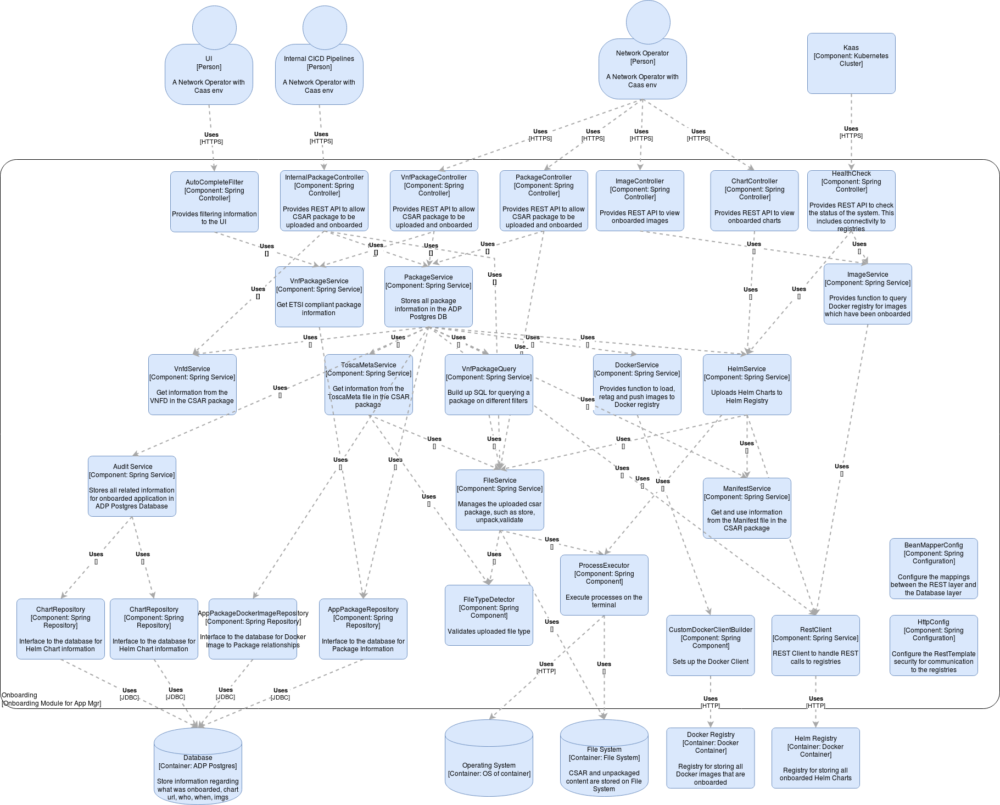

# Application Manager Onboarding Service

## Overview

This service onboards an application to a Kubernetes cluster and places its Helm chart and Docker images into appropriate registries on the cluster.
Details on how this is accomplished can be found in the `README.md` in `am-onboarding-service/charts/eric-am-onboarding-service/README.md` in this repo.

## Things you need to know about this repository

### How to contribute

Contributions are most welcome! Just commit your changes, send for review to `HEAD:refs/for/master`
```
git push origin HEAD:refs/for/master
```
This will kick off a gerrit code review job in jenkins, please see the next section for more detail on the CI Flows.
The link to the jenkins jobs is available in the top level pom in this repo, checkout the `<ciManagement>` tag.
Add the following code review groups to the review: HoneyBadgers, HoneyMonsters, HoneyCossacks, HoneySkywalkers

### CI Flow defined in code

**Note:** If you don't plan on building the repository locally then you can probably skip this section.
We want to leverage DevOps best practices where possible. One such example is to define the CI flow for a project with the following requirements:
* Self generating
* Self managing pipelines
* Reduced setup time when creating new microservices
* Centrally controlled pipelines that can be reconfigured and automatically updated for all flows for each microservice

To achieve this, we have created common CI flows which are code based and use both Jenkins pipelines and job-dsl plugins.
This allows us to pragmatically create Jenkins jobs and pipelines to any configuration we want.
This common code is managed in a separate git repository and added as a git submodule to each microservice repo.
This allows the CI flows to be controlled centrally and common updates can be rolled out to all the microservices CI pipelines without having to make changes in each of these repositories.

To facilitate this, this repo has multiple layers of git submodules, to enable these git submodules, you need to do the following:
- Go to the top level folder of the repository and run the following git command:

    `git submodule update --init --recursive --remote am-ci-flow`

## Design



The design documents for this service can be found in the `design` folder at the root of the repo.
The design is described using the [C4 model](http://c4model.com/).
The design is documented using [draw.io](https://www.draw.io/) with the [C4 plugin](https://github.com/tobiashochguertel/c4-draw.io).
For more information on the C4 model and for installation instructions please see [here](https://confluence-nam.lmera.ericsson.se/pages/viewpage.action?pageId=255537501).
Any design that crosses multiple services will be documented in the [ADP Application Manager integration chart repo](https://gerrit.ericsson.se/plugins/gitiles/OSS/com.ericsson.orchestration.mgmt/am-integration-charts/+/refs/heads/master) or on the [ADP Application Manager Confluence space](https://confluence-nam.lmera.ericsson.se/display/ESO/ADP+Application+Manager).

## Running the Onboarding service in the IDE

The Onboarding service requires three dependencies to run
* a postgres database
* a helm registry
* a docker registry
* a toscao service

All of the above could be stubbed or mocked but in order to properly debug the code, it would be best if we can use real dependencies and this is
 possible. Once these are in place (as outlined in the following sections) it's possible to run the code in debug mode by passing VM arguments e.g. 
```
-Dspring.profiles.active=db
-Ddocker.registry.user.name=vnfm-user
-Ddocker.registry.user.password=DefaultP12345!
-Ddocker.registry.address=docker.hahn000.rnd.gic.ericsson.se
-Dhelm.registry.scheme=http
-Dhelm.registry.host=localhost
-Dhelm.registry.port=9999
-Dhelm.registry.user.name=admin
-Dhelm.registry.user.password=pYs4bkNPg6
-Donboarding.skipToscaoValidation=true
-DskipCertificateValidation=false
```
### Toscao validation

If you want to start service with tosco validation you need to have toscao deployed somewhere on cluster. By default, toscao service does not have 
ingress so it's easier to kubectl portforward into the pod using the command:
```
kubectl -n <namespace> port-forward pod/<toscao-service-pod> 7001:7001 
```
*Note:* This gives us the toscao service access through `http://localhost:7001`/ In case of conflicts - you can use any free local port.

Add environment variables:
```
-Donboarding.skipToscaoValidation=false
-DTOSCAO_PORT=<your-local-toscao-port-value>
```

### Certificate validation

If you want to skip certificates validation:
```
-DskipCertificateValidation=false
```

*Note:* By default certificate validation is enable

### Run a local postgres instance

The easiest way to get postgres running is to pull a docker image and run it locally, you will need to set a password and the port number
```
docker run --name my-postgres -e POSTGRES_PASSWORD=postgres -d -p 5432:5432 postgres
```

If you get an error saying the port is already in use `Error starting userland proxy: listen tcp 0.0.0.0:5432: bind: address already in use`
then you might have an instance of postgres already running, if so you may be able to stop it using the command
```
sudo service postgresql stop
```
The next thing to do is to create the testdb in the running container, there are a few steps to this

kubectl exec into the running postgres instance
```
docker exec -it my-postgres sh
```
Run the postgres interactive shell
```
# psql -U postgres
psql (13.0 (Debian 13.0-1.pgdg100+1))
Type "help" for help.
postgres=#
```
Create the test database
```
postgres=# create database testdb;
CREATE DATABASE
postgres=#
```
By default, test data will be injected into the postgres database when the Onboarding system comes up when the `db` profile active, if you want a
 `clean` database then you need to make small change in the `application-db.yaml` file in the `src/main/resources` folder

Change `flyway.locations: classpath:db/migration,classpath:db/dev` to `flyway.locations: classpath:db/migration`

### Connect to a remote docker registry instance
It's relatively easy to get the Onboarding service to point to a remote docker registry that can be running in a cluster somewhere, all we need is
 the hostname and the access credentials.

Assuming you have an EVNFM deployed in a cluster, the host and access credentials can be got by running the following command
```
kubectl -n <namespace> exec <eric-am-onboarding-service-pod> env | grep -i "docker.registry"
docker.registry.user.name=vnfm-user
docker.registry.user.password=DefaultP12345!
DOCKER_REGISTRY_ADDRESS=docker.hahn000.rnd.gic.ericsson.se
```
Use these values to update the VM options mentioned earlier

### Connect to a remote helm registry instance
We need the helm registry access credentials, we can get these by running the following command
```
kubectl -n <namespace> exec <eric-am-onboarding-service-pod> env | grep -i "helm.registry.user"
helm.registry.user.name=admin
helm.registry.user.password=pYs4bkNPg6
```
Use these values to update the VM options mentioned earlier

By default the helm registry does not have an ingress so it's easier to `kubectl portforward` into the pod using the command
```
kubectl -n <namespace> port-forward pod/<eric-lcm-helm-chart-registry-pod> 9999:8080
```

*Note:* This gives us the helm registry access through `http://localhost:9999`
